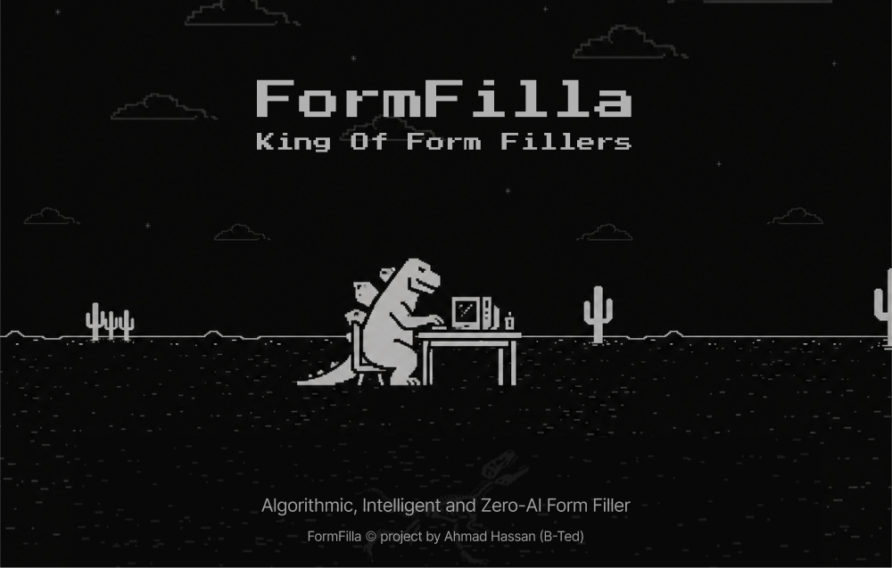
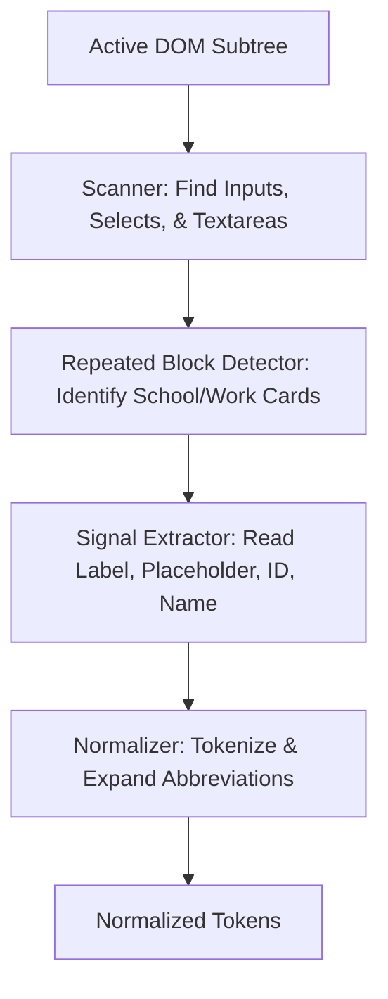
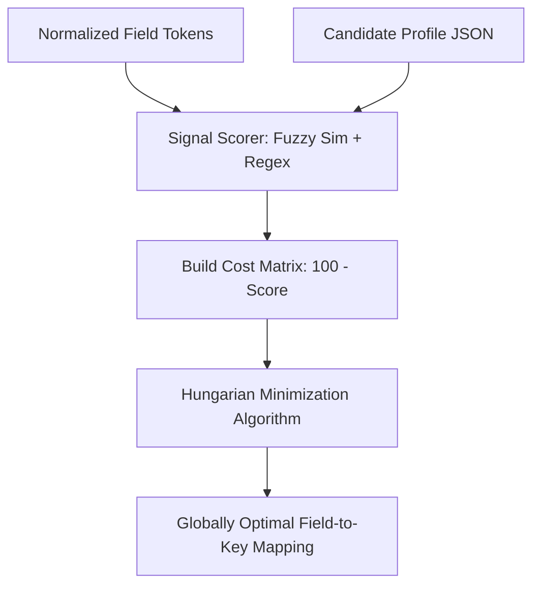
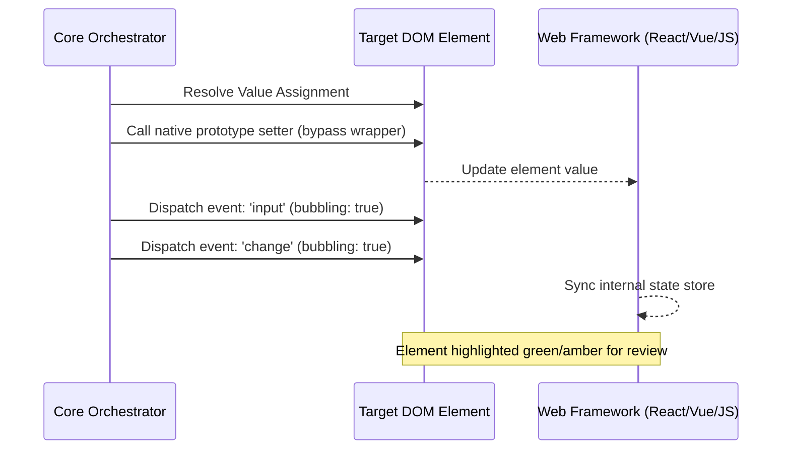

<p align="center">
  

<h1 align="center">FormFilla</h1>

<p align="center">
  
  
  
</p>

<p align="center">
  <strong>A local-first, privacy-respecting form engine designed to restore candidate dignity and speed in the modern job hunt.</strong>
  > **Architecture Note:** *The core extraction engine and DOM manipulation logic for FormFilla are closed-source. This repository serves as the public documentation, issue tracker routing, and release hub for the compiled browser extension.*
</p>

<hr />

## The Philosophy

Job hunting is exhausting, repetitive, and increasingly dehumanizing. Candidates spend hours copy-pasting their professional profiles into applicant tracking systems (ATS) that often parse records inaccurately.

FormFilla was created by **Ahmad Hassan (B-Ted)** to reclaim candidate time. Built as a local-first browser extension, it processes all data in memory, ensuring that personal details (such as contact information, references, and resumes) never leave the local environment.

---

## Technical Architecture

FormFilla runs a structured analysis and injection pipeline inside the browser. It avoids fragile heuristics by utilizing classical bipartite graph matching.

### 1. Element Scanning & Normalization

The system recursively scans the active DOM (including same-origin frame nodes) to locate target inputs. Elements undergo signal normalization (tokenization, case conversions, and abbreviation expansions) before scoring.



### 2. Kuhn-Munkres (Hungarian) Scoring Engine

Rather than using a greedy best-match strategy (which often leads to field misalignments), FormFilla models form filling as a **Maximum Weight Bipartite Matching** problem. The Kuhn-Munkres algorithm solves this globally, maximizing the overall score confidence across the form.



### 3. Framework-Safe DOM Writing

Standard value assignment fails on websites built with modern frameworks (React, Vue, Angular) because virtual DOM trees override standard property setters. FormFilla retrieves the browser's native property setter descriptors and dispatches bubbling events to trigger state updates.



---

## Features & Gates

- **Zero Network Requests:** Data is stored locally using `chrome.storage.local` and IndexedDB. There are no tracking scripts or server APIs.
- **Repeated Block Fingerprinting:** Correctly groups and indexes repeated lists (e.g. multiple jobs or degrees) by checking element layouts.
- **Unified File Transfers:** Simulates drag-and-drop operations using synthetic `DataTransfer` streams to upload local resumes and cover letters.
- **Sensitivity Gating:**
  - **Standard (Green/Amber):** Fills details instantly and highlights them for quick visual checking.
  - **EEO Protections (Opt-in):** Disables equal-opportunity fields unless they are explicitly enabled in the settings panel.
  - **Critical Items (Needs Confirm):** Fields like Social Security Numbers are never auto-filled. Instead, a floating golden badge appears, requiring a manual click to confirm injection.

---

## Directory Structure (Private Repository)

_Note: The following represents the internal architecture of the closed-source FormFilla Repository._

```
FormFilla/
├── docs/                  # Documentation (guides, changelog, roadmap, etc.)
│   ├── assets/            # Documentation images and previews
│   └── infra/             # Infrastructure documentation
├── infra/                 # Infrastructure & deployment configs
│   └── docker/            # Docker Compose & Dockerfile
├── scripts/               # Build & utility scripts
│   ├── build.js           # esbuild bundler configuration
│   ├── generate-icons.ps1 # Icon generation script
│   └── setup.bat          # Windows setup script
├── src/
│   ├── assets/            # Static assets (logos, SVGs)
│   ├── background/        # Service Worker bootstrapping
│   │   └── service-worker.ts
│   ├── content/           # Core runtime engine (closed-source)
│   │   ├── adapters/      # Site-specific platform adapters (Workday, Lever, Greenhouse)
│   │   │   ├── adapter.interface.ts
│   │   │   ├── generic.ts
│   │   │   ├── greenhouse.ts
│   │   │   ├── lever.ts
│   │   │   └── workday.ts
│   │   ├── core/          # Orchestrator and logic bootstrappers
│   │   │   ├── orchestrator.ts
│   │   │   └── value-path.ts
│   │   ├── dom/           # DOM traversal and observers
│   │   │   ├── field-scanner.ts
│   │   │   ├── mutation-watcher.ts
│   │   │   ├── repeated-block.ts
│   │   │   └── signal-extractor.ts
│   │   ├── fill/          # Value injectors and event simulation
│   │   │   ├── combobox-adapter.ts
│   │   │   ├── date-filler.ts
│   │   │   ├── file-filler.ts
│   │   │   ├── native-setter.ts
│   │   │   ├── radio-checkbox-filler.ts
│   │   │   └── select-filler.ts
│   │   ├── matching/      # Scoring & matching algorithms
│   │   │   ├── assignment.ts
│   │   │   ├── fuzzy.ts
│   │   │   ├── normalizer.ts
│   │   │   └── scorer.ts
│   │   └── ui/            # Highlighters and badge widgets
│   │       └── review-highlighter.ts
│   ├── options/           # Dashboard settings panel (HTML/CSS/TS)
│   │   ├── activation-status.ts
│   │   ├── options.css
│   │   ├── options.html
│   │   ├── options.ts
│   │   └── theme-loader.js
│   ├── popup/             # Action panel (HTML/CSS/TS)
│   │   ├── popup.css
│   │   ├── popup.html
│   │   ├── popup.ts
│   │   └── theme-loader.js
│   ├── shared/            # Common drivers, configs, and types
│   │   ├── config/
│   │   │   └── config.ts
│   │   ├── constants/
│   │   │   ├── abbreviations.json
│   │   │   ├── constants.ts
│   │   │   └── degrees.json
│   │   ├── dictionary/
│   │   │   ├── profile-template.json
│   │   │   ├── rules.json
│   │   │   └── rules.ts
│   │   ├── messaging/
│   │   │   └── messages.ts
│   │   ├── storage/
│   │   │   ├── activation-status.ts
│   │   │   ├── feedback.ts
│   │   │   ├── files-storage.ts
│   │   │   ├── github-support.ts
│   │   │   ├── mapping-storage.ts
│   │   │   ├── profile-storage.ts
│   │   │   └── storage-client.ts
│   │   └── types/
│   │       └── index.ts
│   └── themes/            # CSS theme files
│       ├── theme-brutalist-dark.css
│       ├── theme-brutalist-light.css
│       ├── theme-dark.css
│       └── theme-light.css
├── icons/                 # Extension icons (16, 32, 48, 128)
├── store_assets/          # Chrome Web Store promotional assets
├── tests/                 # JSDOM unit test runner suites
│   ├── fixtures/
│   └── scorer.test.ts
├── .editorconfig          # Editor configuration
├── .env.example           # Environment variable template
├── .gitattributes         # Git attributes
├── .gitignore             # Git ignore rules
├── LICENSE                # Proprietary License
├── manifest.json          # Extension manifest (MV3)
├── package.json           # Node dependencies & scripts
├── tsconfig.json          # TypeScript configuration
└── vitest.config.ts       # Test runner configuration
```

---

## AI-Driven Dictionary Expansion (Enhancing Performance)

FormFilla's matching engine relies entirely on externalized JSON databases rather than hardcoded logic. To scale up field matching accuracy and support custom career portals, developers and independent AI models can directly expand these 4 dictionary files. Expanding these files directly increases the coverage and intelligence of the matching solver:

1. **[rules.json](src/shared/dictionary/rules.json) (Field Selectors & Signatures):**
   Defines document guidelines, repeated blocks, and input selectors. Expanding its `exactPhrases` and `regexPatterns` allows FormFilla to map highly customized inputs.
2. **[profile-template.json](src/shared/dictionary/profile-template.json) (Profile Schema Layout):**
   Defines the export template schema. Expand this to align with new fields in `rules.json` to allow user pre-configurations.
3. **[abbreviations.json](src/shared/constants/abbreviations.json) (Acronym maps):**
   Maps common input acronyms (e.g. `emp` -> `employer`). Expanding this prevents tokenization failures on short names.
4. **[degrees.json](src/shared/constants/degrees.json) (Education Rank Matrix):**
   Compares and ranks degrees. Expand this to add local or international variations.

_Every JSON configuration contains an embedded `__meta__` prompt. You can supply these files directly to AI models to securely expand FormFilla's capacity without editing code._

---

## Installation

FormFilla is officially distributed through the Chrome Web Store to ensure you always receive the latest, secure updates directly to your browser.

**[Install FormFilla from the Chrome Web Store](#)** _(Link will be added upon store approval)_

## Roadmap

- **Q3 2026:** Custom field selection overrides saved to local storage.
- **Q4 2026:** Platform adapters for Taleo, Workable, and Breezy HR.
- **Q1 2027:** Encrypted profile backup exports using client-side AES-GCM.

---

## Bugs & Feature Requests

We manage all feedback, bugs, and feature requests centrally to maintain a clean workflow.

If you encounter an issue or have a feature idea for FormFilla, please submit it to our central board:
**[Open the Central Issue Tracker](https://github.com/AhmadHassan-BTed/FormFilla/issues)**

---

## License

The documentation and public assets in this repository are available for viewing, but the FormFilla software itself is Proprietary and closed-source.
